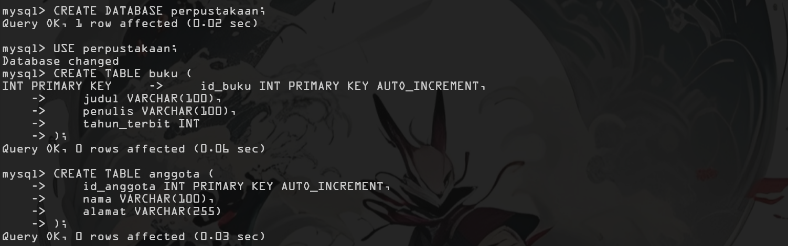
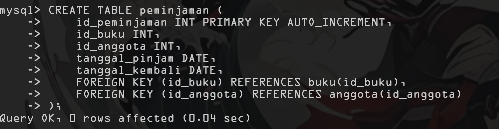
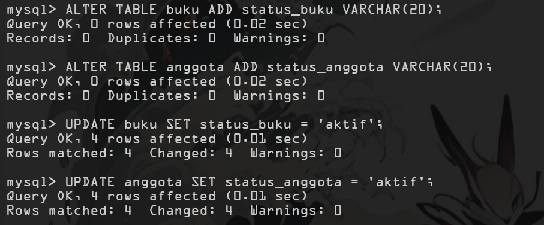
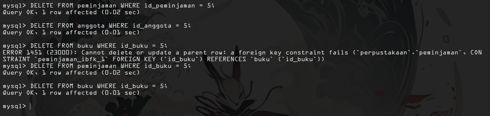
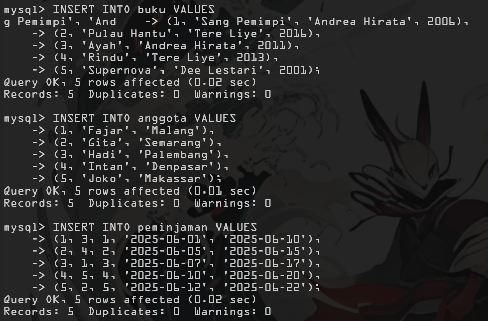
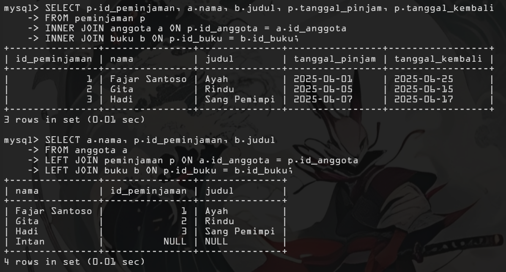
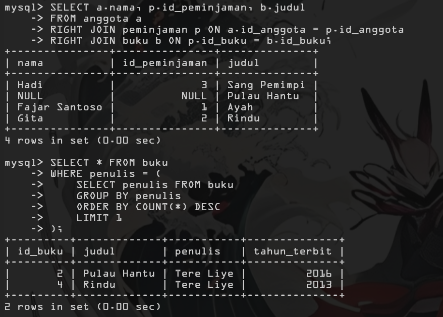
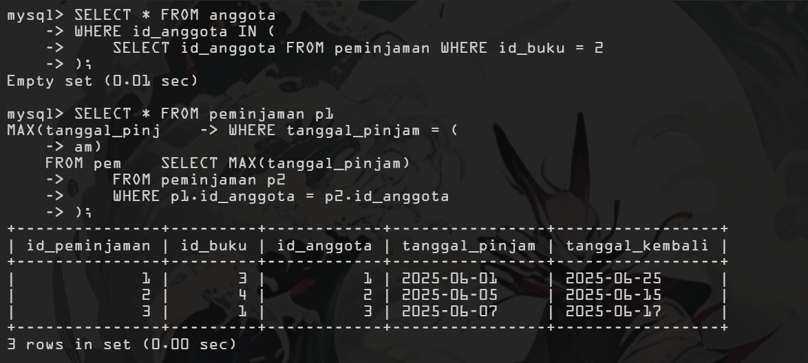
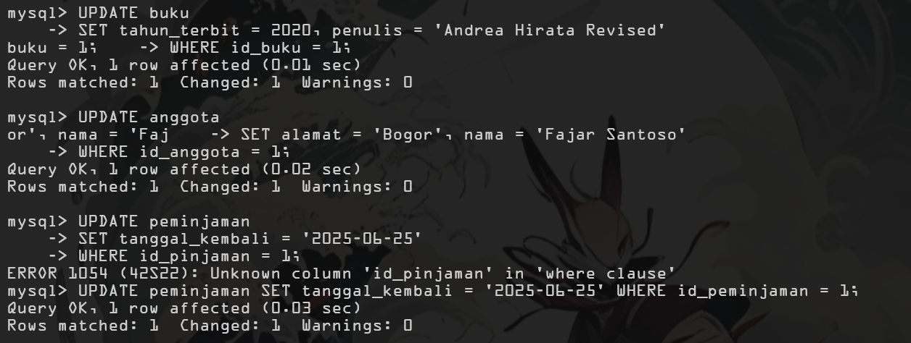

# Sistem Perpustakaan - UTS Project

Proyek ini merupakan implementasi sistem perpustakaan sederhana yang dikembangkan untuk memenuhi UTS Matakuliah Sistem Basis Data dan Pemrograman Web.

## 📋 Deskripsi Project

Sistem perpustakaan ini terdiri dari dua bagian:
1. **Database System** - Implementasi database menggunakan MySQL
2. **Web Application** - Aplikasi web berbasis PHP untuk mengelola data perpustakaan

## 🗄️ Database Schema

### Struktur Database
- Database: `perpustakaan`
- Tabel utama:
  - `buku` - Data koleksi buku
  - `anggota` - Data anggota perpustakaan
  - `peminjaman` - Data transaksi peminjaman

### Entity Relationship Diagram
```
┌─────────────┐    ┌──────────────────┐    ┌────────────────┐
│    BUKU     │    │   PEMINJAMAN     │    │   ANGGOTA      │
├─────────────┤    ├──────────────────┤    ├────────────────┤
│ id_buku (PK)│◄───┤ id_buku (FK)     │    │ id_anggota(PK) │
│ judul       │    │ id_anggota (FK)  ├───►│ nama           │
│ penulis     │    │ tanggal_pinjam   │    │ alamat         │
│ tahun_terbit│    │ tanggal_kembali  │    │ status_anggota │
│ status_buku │    │ id_peminjaman(PK)│    └────────────────┘
└─────────────┘    └──────────────────┘
```

## 📊 UTS Sistem Basis Data - SQL Implementation

### 1. Membuat Database
```sql
CREATE DATABASE perpustakaan;
USE perpustakaan;
```

### 2. Membuat Tabel Buku
```sql
CREATE TABLE buku (
    id_buku INT PRIMARY KEY AUTO_INCREMENT,
    judul VARCHAR(100),
    penulis VARCHAR(100),
    tahun_terbit INT
);
```

### 3. Membuat Tabel Anggota
```sql
CREATE TABLE anggota (
    id_anggota INT PRIMARY KEY AUTO_INCREMENT,
    nama VARCHAR(100),
    alamat VARCHAR(255)
);
```

### 4. Membuat Tabel Peminjaman
```sql
CREATE TABLE peminjaman (
    id_peminjaman INT PRIMARY KEY AUTO_INCREMENT,
    id_buku INT,
    id_anggota INT,
    tanggal_pinjam DATE,
    tanggal_kembali DATE,
    FOREIGN KEY (id_buku) REFERENCES buku(id_buku),
    FOREIGN KEY (id_anggota) REFERENCES anggota(id_anggota)
);
```

### 5. Insert Data Sample
**Data Buku:**
```sql
INSERT INTO buku VALUES
(1, 'Laskar Pelangi', 'Andrea Hirata', 2005),
(2, 'Bumi', 'Tere Liye', 2014),
(3, 'Negeri 5 Menara', 'Ahmad Fuadi', 2009),
(4, 'Ayat-Ayat Cinta', 'Habiburrahman El Shirazy', 2004),
(5, 'Pulang', 'Leila S. Chudori', 2012);
```

**Data Anggota:**
```sql
INSERT INTO anggota VALUES
(1, 'Ali', 'Jakarta'),
(2, 'Budi', 'Bandung'),
(3, 'Citra', 'Surabaya'),
(4, 'Dina', 'Yogyakarta'),
(5, 'Eka', 'Medan');
```

**Data Peminjaman:**
```sql
INSERT INTO peminjaman VALUES
(1, 1, 2, '2025-05-01', '2025-05-10'),
(2, 2, 3, '2025-05-02', '2025-05-12'),
(3, 3, 4, '2025-05-03', '2025-05-13'),
(4, 4, 1, '2025-05-04', '2025-05-14'),
(5, 5, 5, '2025-05-05', '2025-05-15');
```

### 6. Update Operations
```sql
UPDATE buku SET judul = 'Laskar Pelangi Edisi Baru' WHERE id_buku = 1;
UPDATE anggota SET alamat = 'Jakarta Selatan' WHERE id_anggota = 1;
UPDATE peminjaman SET tanggal_kembali = '2025-05-20' WHERE id_peminjaman = 1;
```

### 7. Delete Operations
```sql
DELETE FROM peminjaman WHERE id_peminjaman = 5;
DELETE FROM anggota WHERE id_anggota = 5;
DELETE FROM buku WHERE id_buku = 5;
```

### 8. Join Operations

**INNER JOIN:**
```sql
SELECT p.id_peminjaman, a.nama, b.judul, p.tanggal_pinjam, p.tanggal_kembali
FROM peminjaman p
INNER JOIN anggota a ON p.id_anggota = a.id_anggota
INNER JOIN buku b ON p.id_buku = b.id_buku;
```

**LEFT JOIN:**
```sql
SELECT a.nama, p.id_peminjaman, b.judul
FROM anggota a
LEFT JOIN peminjaman p ON a.id_anggota = p.id_anggota
LEFT JOIN buku b ON p.id_buku = b.id_buku;
```

**RIGHT JOIN:**
```sql
SELECT a.nama, p.id_peminjaman, b.judul
FROM anggota a
RIGHT JOIN peminjaman p ON a.id_anggota = p.id_anggota
RIGHT JOIN buku b ON p.id_buku = b.id_buku;
```

### 9. Subquery Examples

**Subquery:**
```sql
SELECT * FROM buku
WHERE penulis = (
    SELECT penulis FROM buku
    GROUP BY penulis
    ORDER BY COUNT(*) DESC
    LIMIT 1
);

SELECT * FROM anggota
WHERE id_anggota IN (
    SELECT id_anggota FROM peminjaman WHERE id_buku = 2
);

SELECT * FROM peminjaman p1
WHERE tanggal_pinjam = (
    SELECT MAX(tanggal_pinjam)
    FROM peminjaman p2
    WHERE p1.id_anggota = p2.id_anggota
);
```

### 10. Menambah Kolom Baru
```sql
ALTER TABLE buku ADD status_buku VARCHAR(20);
ALTER TABLE anggota ADD status_anggota VARCHAR(20);
```

## 🖥️ Screenshot dan Demo










## 👥 Keterangan
- **Nama Mahasiswa:** Yoga Pangestu
- **NIM:** 2457201008
- **Mata Kuliah:** Sistem Basis Data & Pemrograman Berbasis Web
- **Dosen:** Muhammad Hilmi Fauzan

## 📄 Lisensi
Projek ini dibuat untuk keperluan akademik UTS Sistem Basis Data dan Pemrograman Berbasis Web.

---

- **Tanggal Pembuatan:** 2025-23-05 
- **Video Penjelasan:**  https://drive.google.com/file/d/1f9ZjBb9GrtmnJcLn1skNeiZqOfoVoORd/view?usp=drive_link